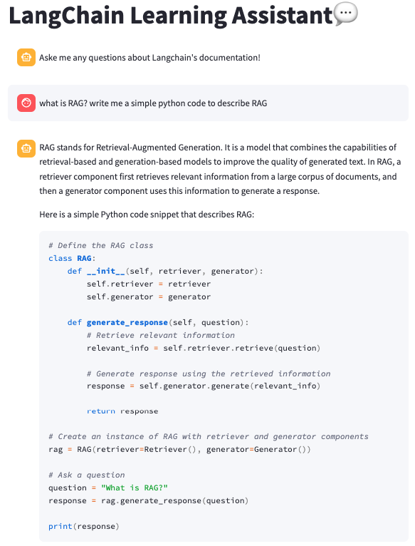

# LangChain Documentation Query App

This repository contains a LangChain Documentation Query App that helps users query the documentation from the LangChain tutorials website. The app is built using LlamaIndex, Pinecone, OpenAI API, and Streamlit.



## Project Overview

The project is designed to facilitate querying documentation from the LangChain tutorials website. The app performs the following steps:

1. **Data Extraction:** Using BeautifulSoup to scrape all the documentation from the LangChain tutorials website.
2. **Vector Store Creation:** Using Pinecone to build a vector store (RAG system) for efficient querying.
3. **Interface Creation:** Using OpenAI API and Streamlit to create an interactive app interface.

## Table of Contents

- [Project Overview](#project-overview)
- [Installation](#installation)
- [Usage](#usage)
- [Features](#features)
- [Contributing](#contributing)
- [License](#license)

## Installation

### Prerequisites

Before you begin, ensure you have met the following requirements:

- Python 3.10+
- An OpenAI API key
- A Pinecone account and API key

### Setup

1. Clone this repository:

    ```bash
    git clone https://github.com/acn-thaihanguyen/langchain-doc-query-app.git
    cd langchain-doc-query-app
    ```

2. Create virtual environment and install the required packages:

    ```bash
    python -m venv ai_chat
    source ai_chat/bin/activate
    pip install -r requirements.txt
    ```

3. Set up your environment variables:

    Create a `.env` file in the project root and add your OpenAI and Pinecone API keys (examples provided in .env.sample):

    ```env
    OPENAI_API_KEY=your-openai-api-key
    OPENAI_MODEL=your-openai-model
    OPENAI_EMBEDED_MODEL=your-openai-embedded-model
    PINECONE_API_KEY=your-pinecone-api-key
    ```

## Usage

1. **Scraping Documentation:**

    Run the script to scrape documentation from the LangChain tutorials website:

    ```bash
    python src/scrape_docs.py
    ```

2. **Building the Vector Store:**

    Use the script to build a vector store using Pinecone:

    ```bash
    python src/build_vector_store.py
    ```

3. **Running the App:**

    Start the Streamlit app:

    ```bash
    streamlit run app.py
    ```

4. **Querying Documentation:**

    Open the app in your browser, and enjoy your learning with AI assistant.

## Features

- **Documentation Scraping:** Automatically scrapes documentation from the LangChain tutorials website using BeautifulSoup.
- **Vector Store:** Efficiently stores and retrieves document vectors using Pinecone.
- **Interactive Interface:** User-friendly app interface built with Streamlit and powered by OpenAI API.
- **Real-time Querying:** Quickly queries and retrieves relevant documentation snippets based on user input.

## Contributing

Contributions are welcome! Please follow these steps:

1. Fork the repository.
2. Create a new branch (`git checkout -b feature/your-feature`).
3. Make your changes.
4. Commit your changes (`git commit -m 'Add some feature'`).
5. Push to the branch (`git push origin feature/your-feature`).
6. Open a pull request.

## License

This project is licensed under the MIT License. See the [LICENSE](LICENSE) file for details.

## Acknowledgements

- [BeautifulSoup](https://www.crummy.com/software/BeautifulSoup/bs4/doc/)
- [Pinecone](https://www.pinecone.io/)
- [OpenAI](https://www.openai.com/)
- [Streamlit](https://streamlit.io/)
- [LlamaIndex](https://docs.llamaindex.ai/en/stable/)

---

## File Descriptions

- `scrape_docs.py`: Script to scrape documentation from the LangChain tutorials website.
- `build_vector_store.py`: Script to build a vector store using Pinecone.
- `app.py`: Streamlit app script to create the interactive user interface.
- `requirements.txt`: List of required Python packages.
- `.env`: Environment variables file to store API keys.
